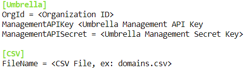
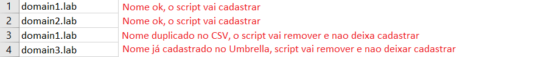
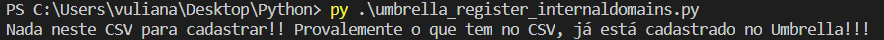
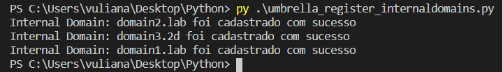
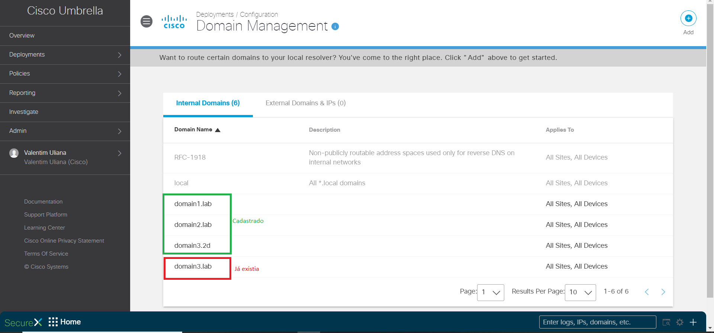

# Cisco Umbrella Internal Domains Register

Este repositório contém um script em Python que cria Internal Domains no Cisco Umbrella a partir de um CSV, facilitando para cadastro de domínios em massa.

API key e API secret do <a href="https://docs.umbrella.com/umbrella-api/docs/authentication-and-errors">Cisco Umbrella Management API</a> também é necessário para execução do script.

O ID da sua Organização do Umbrella também é necessário para execução do script! Use <a href = "https://docs.umbrella.com/deployment-umbrella/docs/find-your-organization-id" target="_blank">esta documentação</a> para saber como obter seu Organization ID.

Se não tiver as bibliotecas Python necessárias configuradas, receberá um erro ao executar o script. Você precisará instalar o arquivo "requirements.txt": (certifique-se de que está no mesmo diretório que os arquivos clonados do git): 
<b> pip install -r requirements.txt</b> 

# Arquivo de configuração, modificar com seus dados e credenciais antes de rodar o script
   

# Como funciona ??
• Após coletar as informações do CSV indicado, e caso ele exista, o script vai rodar e cadastrar todos os dómios no CSV, com algumas exceções explicada nas Features  
• O CSV deve ser preenchido da seguinte forma para que o script funcione corretamente 
  

# Features
• O script trabalha de forma totalmente inteligente, faz verificações básicas e avançadas, e toma as decisões corretamente, entre elas: 
1. Remove do CSV qualquer tipo de informação que esteja exatamente duplicada
2. Compara o CSV com o que já está cadastrado no Umbrella, caso já esteja, o script automáticamente remove esses dados e não os envia para cadastro, só envia realmente o que não estiver cadastrado no Umbrella. <b>Com isso facilita muito a vida do usuário!!</b>

# Imagens funcionamento do script
 
 
<b> Dashboard Umbrella mostrando cadastrado!
 
